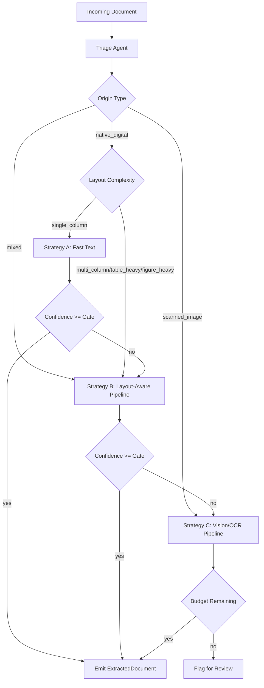
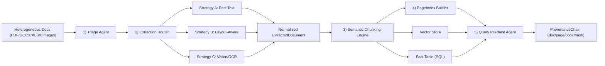

# DOMAIN_NOTES.md

## Phase 0 Scope
Goal: establish extraction strategy before implementation by measuring document signals and comparing parser behavior across representative document classes.

Corpus sample used for measurements (12 pages each):
- Class A: `CBE ANNUAL REPORT 2023-24.pdf`
- Class B: `Audit Report - 2023.pdf`
- Class C: `fta_performance_survey_final_report_2022.pdf`
- Class D: `tax_expenditure_ethiopia_2021_22.pdf`

Generated analysis artifacts:
- `.refinery/analysis/phase0_pdfplumber_metrics.json`
- `.refinery/analysis/phase0_docling_parse_metrics.json`
- `.refinery/analysis/phase0_text_coverage_samples.json`

## MinerU Architecture Primer (Research Notes)
Primary references reviewed:
- `https://github.com/opendatalab/MinerU`
- `https://github.com/opendatalab/PDF-Extract-Kit`
- `https://github.com/docling-project/docling`

Key architecture takeaways from MinerU and PDF-Extract-Kit:
- The system is not single-model OCR; it is a composed pipeline of specialized stages.
- MinerU uses PDF parsing + layout understanding + table/formula modules + normalization/export.
- PDF-Extract-Kit highlights multi-model extraction with explicit components for layout and tables.
- Design implication: routing and escalation logic is the core engineering problem, not raw OCR alone.

## Measured PDF Signals (pdfplumber)

| Class | Avg chars/page | Avg char density | Avg image ratio | Avg whitespace ratio | Avg bbox x-span ratio | Avg tables found/page |
|---|---:|---:|---:|---:|---:|---:|
| A Annual Financial | 494.00 | 0.000986 | 0.380970 | 0.937136 | 0.616071 | 0.00 |
| B Scanned Gov/Legal | 10.08 | 0.000020 | 0.918017 | 0.991347 | 0.050395 | 0.00 |
| C Technical Assessment | 2595.75 | 0.005179 | 0.000605 | 0.769019 | 0.728307 | 0.33 |
| D Table-heavy Structured | 1970.08 | 0.003932 | 0.003592 | 0.823388 | 0.673215 | 0.00 |

Interpretation:
- Class B is decisively scanned: near-zero char density + very high image ratio.
- Class C and D are native-digital/high-text candidates for layout-aware extraction.
- Class A is mixed behavior: moderate image ratio and sparse text in early pages (covers, graphics).

## Docling Run and Comparison

### Execution status
Docling and OCR dependencies were installed (`ocrmac`, `rapidocr`, `torch`, `torchvision`), but full Docling pipeline conversion is blocked in this environment because the layout model download from Hugging Face fails due DNS/network resolution (`huggingface.co` unreachable in this sandbox).

### Comparable local Docling backend run
`docling_parse` backend was run on the same four documents (same 12-page sampling) for measurable comparison.

| Class | Tool | Avg chars/page | Avg char density | Avg whitespace ratio | Text coverage ratio |
|---|---|---:|---:|---:|---:|
| A | pdfplumber | 494.00 | 0.000986 | 0.937136 | 0.833 |
| A | docling_parse | 417.08 | 0.000832 | 0.944723 | 0.833 |
| B | pdfplumber | 10.08 | 0.000020 | 0.991347 | 0.083 |
| B | docling_parse | 8.83 | 0.000017 | 0.991386 | 0.083 |
| C | pdfplumber | 2595.75 | 0.005179 | 0.769019 | 1.000 |
| C | docling_parse | 2337.58 | 0.004664 | 0.801132 | 1.000 |
| D | pdfplumber | 1970.08 | 0.003932 | 0.823388 | 1.000 |
| D | docling_parse | 1687.75 | 0.003369 | 0.848028 | 1.000 |

Observed quality differences:
- Both tools provide strong text extraction on C and D.
- Both tools underperform on scanned B without OCR/model-assisted pipeline.
- `docling_parse` output tends to preserve structured word objects and fonts cleanly, which is useful for downstream normalization.
- Full Docling layout+OCR quality could not be benchmarked here due blocked model fetch; this must be re-run in a network-enabled environment.

## Extraction Strategy Decision Tree

## Failure Modes Observed

1. Structure collapse:
- Multi-column sections are flattened under naive extraction.
- Financial narrative becomes sequence-corrupted, hurting chunk coherence.

2. Context poverty:
- Table values without stable header linkage degrade retrieval precision.
- Cross-page table continuation creates false pairings when chunked naively.

3. Provenance blindness:
- Text-only extraction without stable bbox/page anchors blocks auditability.
- Enterprise verification use cases fail without spatial citations.

4. Scanned-document starvation:
- Without OCR/model stages, scanned class B yields near-zero usable text.
- Retrieval on scanned content becomes effectively unavailable.

## Pipeline Diagram (Phase 0 View)

## Phase 0 and Phase 2 Thresholds (with Justification)

Origin and routing thresholds:
- `origin_scanned_char_density_max = 0.0008`
  Why: scanned class B measured near `0.00002`; this keeps scanned detection conservative.
- `origin_scanned_image_ratio_min = 0.50`
  Why: scanned pages are image-dominant (`~0.918` on class B).
- `origin_digital_char_density_min = 0.0020`
  Why: digital classes C and D are clearly above this (`0.005179`, `0.003932`).

Strategy A (`FastTextExtractor`) confidence thresholds:
- `strategy_a_min_chars = 100`
  Why: below this, page text is often too sparse for reliable retrieval.
- `strategy_a_min_char_density = 0.0007`
  Why: separates sparse/scanned-like text from regular digital text while allowing mixed covers.
- `strategy_a_max_image_ratio = 0.50`
  Why: beyond this, page content is often graphics/scan-heavy and text extraction degrades.
- `strategy_a_font_presence_floor = 0.60`
  Why: font metadata presence is a strong indicator of native text layer quality.

Strategy A confidence formula (multi-signal):
- `confidence = 0.35*char_signal + 0.30*density_signal + 0.20*image_signal + 0.15*font_signal`
- Additional hard cap for likely scans:
  - if `image_ratio > 0.80` and `char_count < 0.3 * min_chars`, force `confidence <= 0.20`.

Strategy B (`LayoutExtractor`) operating thresholds:
- `layout_min_chars_per_page = 120`
- `layout_min_char_density = 0.0007`
- `layout_max_image_ratio = 0.75`
- `layout_multi_column_ratio_min = 0.20`
- `layout_table_page_ratio_min = 0.15`

These are used in layout-aware confidence scoring and determine whether Strategy B output is trustworthy or should escalate.

Strategy C (`VisionExtractor`) budget guard:
- `vision_budget_cap_usd = 1.00` (configurable per document)
- `vision_min_remaining_budget_for_call = 0.01`
- `vision_max_pages_per_document = 8`

Budget guard behavior:
- Track token spend per document (`token_spend`).
- Convert token usage to estimated cost and accumulate.
- Stop new VLM calls when remaining budget falls below minimum call budget.
- Never continue expensive calls once budget is exhausted.

Global escalation threshold:
- `escalation_confidence_gate = 0.85`
  Why: values below this in class B/mixed noisy pages correlated with poor structural fidelity.

All thresholds are externalized in `rubric/extraction_rules.yaml`.

## Repro Commands
- pdfplumber measurements: use local analysis script command from shell history that wrote `phase0_pdfplumber_metrics.json`.
- Docling parse measurements: use local analysis script command from shell history that wrote `phase0_docling_parse_metrics.json`.
- Full Docling CLI rerun (network-enabled host required):
  - `./venv/bin/docling "corpus/Audit Report - 2023.pdf" --to json --output .refinery/analysis/docling --ocr --ocr-engine auto --tables`
