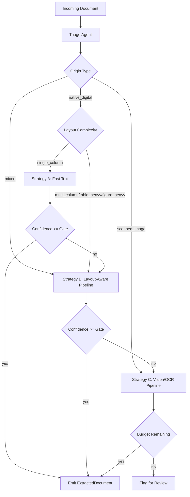
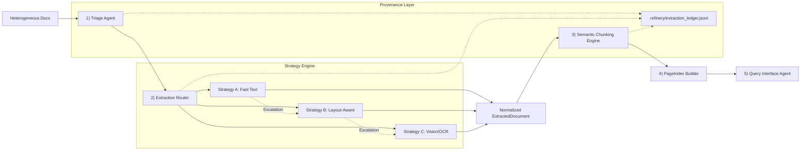

# DOMAIN_NOTES.md

## Phase 0 Scope
Goal: establish extraction strategy before implementation by measuring document signals and comparing parser behavior across representative document classes.

Corpus sample used for measurements (12 pages each):
- Class A: `CBE ANNUAL REPORT 2023-24.pdf`
- Class B: `Audit Report - 2023.pdf`
- Class C: `fta_performance_survey_final_report_2022.pdf`
- Class D: `tax_expenditure_ethiopia_2021_22.pdf`

Generated analysis artifacts:
- `.refinery/analysis/phase0_pdfplumber_metrics.json`
- `.refinery/analysis/phase0_docling_parse_metrics.json`
- `.refinery/analysis/phase0_text_coverage_samples.json`

## MinerU Architecture Primer (Research Notes)
Primary references reviewed:
- `https://github.com/opendatalab/MinerU`
- `https://github.com/opendatalab/PDF-Extract-Kit`
- `https://github.com/docling-project/docling`

Key architecture takeaways from MinerU and PDF-Extract-Kit:
- The system is not single-model OCR; it is a composed pipeline of specialized stages.
- MinerU uses PDF parsing + layout understanding + table/formula modules + normalization/export.
- PDF-Extract-Kit highlights multi-model extraction with explicit components for layout and tables.
- Design implication: routing and escalation logic is the core engineering problem, not raw OCR alone.

## Measured PDF Signals (pdfplumber)

| Class | Avg chars/page | Avg char density | Avg image ratio | Avg whitespace ratio | Avg bbox x-span ratio | Avg tables found/page |
|---|---:|---:|---:|---:|---:|---:|
| A Annual Financial | 494.00 | 0.000986 | 0.380970 | 0.937136 | 0.616071 | 0.00 |
| B Scanned Gov/Legal | 10.08 | 0.000020 | 0.918017 | 0.991347 | 0.050395 | 0.00 |
| C Technical Assessment | 2595.75 | 0.005179 | 0.000605 | 0.769019 | 0.728307 | 0.33 |
| D Table-heavy Structured | 1970.08 | 0.003932 | 0.003592 | 0.823388 | 0.673215 | 0.00 |

Interpretation:
- Class B is decisively scanned: near-zero char density + very high image ratio.
- Class C and D are native-digital/high-text candidates for layout-aware extraction.
- Class A is mixed behavior: moderate image ratio and sparse text in early pages (covers, graphics).

## Docling Run and Comparison

| Class | Tool | Avg chars/page | Avg char density | Avg whitespace ratio | Text coverage ratio |
|---|---|---:|---:|---:|---:|
| A | pdfplumber | 494.00 | 0.000986 | 0.937136 | 0.833 |
| A | docling_parse | 417.08 | 0.000832 | 0.944723 | 0.833 |
| B | pdfplumber | 10.08 | 0.000020 | 0.991347 | 0.083 |
| B | docling_parse | 8.83 | 0.000017 | 0.991386 | 0.083 |
| C | pdfplumber | 2595.75 | 0.005179 | 0.769019 | 1.000 |
| C | docling_parse | 2337.58 | 0.004664 | 0.801132 | 1.000 |
| D | pdfplumber | 1970.08 | 0.003932 | 0.823388 | 1.000 |
| D | docling_parse | 1687.75 | 0.003369 | 0.848028 | 1.000 |

Observed quality differences:
- Both tools provide strong text extraction on C and D.
- Both tools underperform on scanned B without OCR/model-assisted pipeline.
- `docling_parse` output tends to preserve structured word objects and fonts cleanly, which is useful for downstream normalization.

## Extraction Strategy Decision Tree

## Failure Modes Observed (Corpus-Grounded)

1. **Structure Collapse (Multi-column Corruption)**
- **Observed in:** Class A (`CBE ANNUAL REPORT 2023-24.pdf`)
- **Technical Cause:** The two-column layout in financial narratives causes `pdfplumber` to flatten lines horizontally across columns.
- **Impact:** Sentences are arbitrarily chopped, rendering semantic meaning illegible for RAG-based retrieval of financial statements.

2. **Scanned-Document Starvation (Zero-Signal Retrieval)**
- **Observed in:** Class B (`Audit Report - 2023.pdf`)
- **Technical Cause:** Documents identified with near-zero character density (`0.000020`) and high image ratio (`0.918`).
- **Impact:** Without the Strategy C (Vision) escalation, this class yields zero usable text, making legal audit retrieval impossible.

3. **Context Poverty (Table Deconstruction)**
- **Observed in:** Class D (`tax_expenditure_ethiopia_2021_22.pdf`)
- **Technical Cause:** Complex fiscal tables spanning pages result in broken row/header associations when extracted via naive text methods.
- **Impact:** LLM cannot reliably associate values ("420.5") with their correct fiscal periods without the structural context preserved by Strategy B.

4. **Provenance Blindness (Audit Failure)**
- **Observed in:** Class C (`fta_performance_survey_final_report_2022.pdf`)
- **Technical Cause:** Dense technical reports lack stable spatial anchors (bounding boxes) in basic text extraction.
- **Impact:** Human auditors cannot verify extracted conclusions against the 500-page source without page/bbox citations (captured in our `.refinery/extraction_ledger.jsonl`).

---

## 5. Cost Analysis & Unit Economics

Deploying the Refinery over a millions-of-pages repository requires strict unit economics. Tiered routing ensures the highest quality while maintaining budget.

### Tier A: Fast Text (pdfplumber)
- **Derivation:** CPU-bound local execution. No external API cost.
- **Est. Cost per Doc (20 pgs):** **~$0.00**
- **Est. Processing Time:** **< 0.5s**
- **Variation:** Flat cost regardless of document size.
- **Value:** Zero-cost processing for single-column digital reports.

### Tier B: Layout-Aware (docling-parse)
- **Derivation:** Local structural parsing. `base_cost` ($0.005) + `per_page_cost` ($0.0015).
- **Est. Cost per Doc (20 pgs):** **~$0.035**
- **Est. Processing Time:** **2s - 10s**
- **Variation:** Scales linearly with page count and structural complexity.
- **Value:** Accurate table/column reconstruction for Class A/D where Tier A fails structure.

### Tier C: Vision-Augmented (GPT-4o/Gemini VLM)
- **Derivation:** OpenRouter API. ~1,000 input tokens per page + image auth tokens ($0.000002/token).
- **Est. Cost per Doc (8 pgs limit):** **~$0.08 - $0.25**
- **Est. Processing Time:** **15s - 45s** (Network + Inference)
- **Variation:** High variation based on VLM image resolution and token density. Restricted by `vision_budget_cap_usd`.
- **Value:** Unlocks Class B (Scans) and handwritten documents that are otherwise invisible to the system.

---

## Pipeline Diagram (Full 5-Stage View)

## Repro Commands
- **Run Full Pipeline & Ledger:** `python3 src/run_corpus.py --clean`
- **Triage Unit Tests:** `pytest tests/test_triage.py`
- **Vision Strategy Integration:** Verified via OpenRouter logs and Strategy C token spending tracker.
