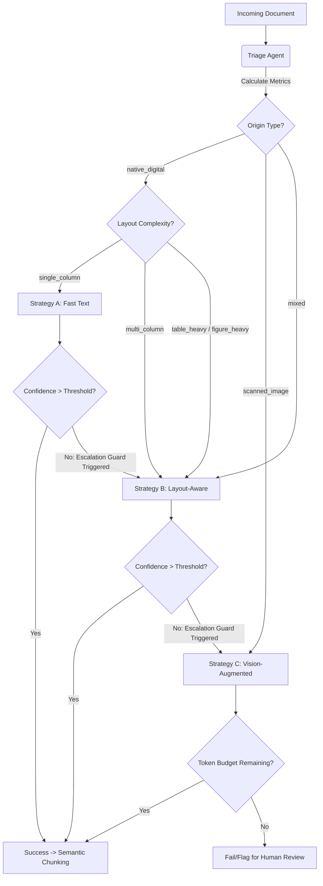
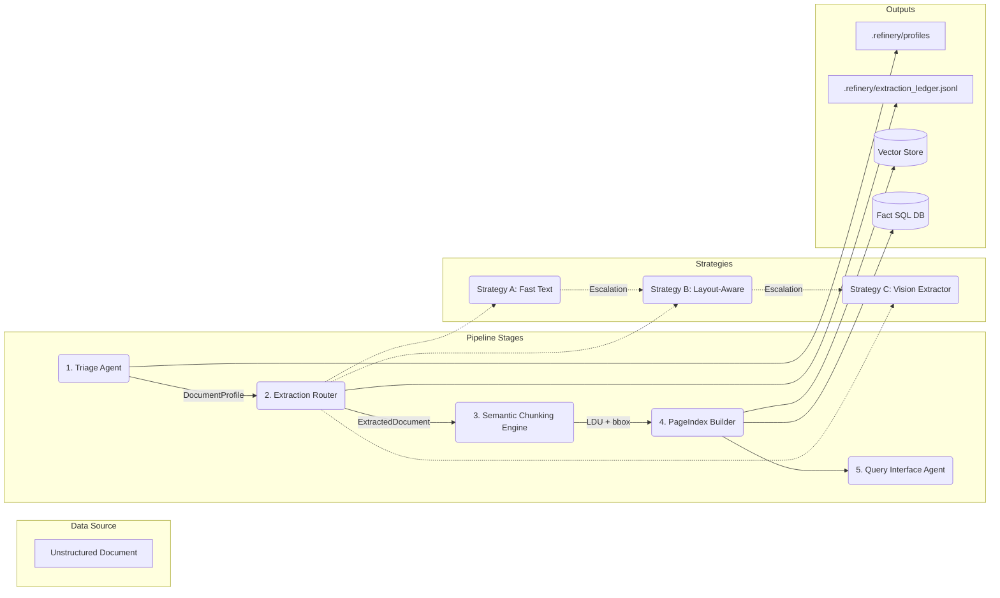

# DOMAIN NOTES & ARCHITECTURE

## 1. Extraction Strategy Decision Tree (Phase 0)

The extraction routing logic is governed by heuristics applied to a small sample of pages (e.g., first 3-5 pages). High-bandwidth extraction always supersedes low-bandwidth extraction if confidence metrics allow.

---

## 2. Failure Modes Observed Across Document Types

Understanding the specific flaws in single-strategy extraction informs our confidence gates.

1.  **Structure Collapse (Traditional OCR):**
    *   **Problem:** Multi-column layouts are flattened horizontally.
    *   **Observation:** A two-column report reads straight across lines instead of down the left column then right column.
    *   **Impact on RAG:** Sentences are arbitrarily chopped, rendering semantic meaning illegible.
2.  **Context Poverty (Table Deconstruction):**
    *   **Problem:** Financial tables are extracted as raw string dumps.
    *   **Observation:** `pdfplumber` alone will read a cell value ("420.5") without capturing its correlation to the column header ("Q3 Revenue") or row header ("Operating Expense").
    *   **Impact on RAG:** The LLM cannot reliably associate values with their correct categories.
3.  **Provenance Blindness (Lost Coordinates):**
    *   **Problem:** Once text is scraped from a PDF, its spatial origin is discarded.
    *   **Observation:** An LLM generates an answer, but a human auditor cannot verify it against a 500-page bank report.
    *   **Impact on RAG:** Answers cannot be mapped back to a bounding box, preventing enterprise adoption due to zero auditability.

---

## 3. Architecture Overview: Full 5-Stage Pipeline

### Strategy Routing Logic Summary
*   **Strategy A (pdfplumber):** Executes when text density is high (>100 chars/page) and image area ratio is low (<50%). If a page returns nulls or broken chunks, the **Escalation Guard** trips.
*   **Strategy B (Docling / MinerU):** Executes if variance in line bounding boxes implies multi-column text, or if border lines imply heavy tabular data. Normalizes output into text blocks and JSON tables.
*   **Strategy C (VLM via OpenRouter):** The final fallback. Used instantly if text density approaches zero (scanned PDF), or if lower strategies fail their confidence thresholds.

---

## 4. Cost Analysis

Deploying LLMs over a 10M page corporate repository requires strict unit economics. The goal of the triage layer is to push as much volume as possible into Tier A/B.

| Strategy Tier | Model / Tool | Compute Required | Estimated Cost Per Document (Avg 20 pgs) | Ideal Workload Allocation |
| :--- | :--- | :--- | :--- | :--- |
| **Strategy A** (Fast Text) | `pdfplumber` / `PyMuPDF` | CPU Only (negligible) | **~$0.00** | 40% (Single col, native text docs) |
| **Strategy B** (Layout-Aware) | `Docling` / `MinerU` | CPU / Light GPU | **~$0.00 - ~$0.01** (Compute time) | 50% (Two-col, table heavy, native PDFs) |
| **Strategy C** (Vision VLM) | `gemini-1.5-flash` / `gpt-4o-mini` | Heavy API Calls | **~$0.05 - ~$0.15** (Input token auth) | 10% (pure scans, handwritten, extreme layouts) |

*Calculations based on an average Document holding ~20,000 tokens / 20 pages.* The **Extraction Ledger** will precisely track this cost to prevent budget overruns via a strict document-level token guard.
