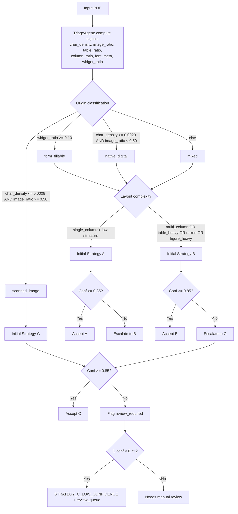
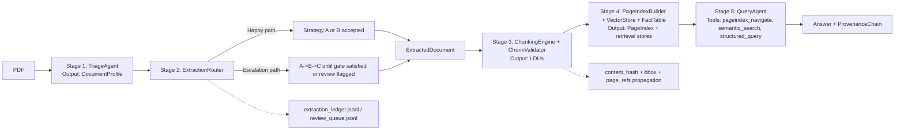

# Document Intelligence Refinery: Final Submission Report

## 1. Executive Summary
This report presents the final-stage implementation and evaluation of the Document Intelligence Refinery across a heterogeneous corpus of Ethiopian financial, audit/legal, technical, and fiscal documents. The system is designed for real FDE conditions where documents vary widely in origin quality (native digital, mixed, scanned, form-fillable), layout complexity, and extraction risk.

The final architecture is **domain-driven and confidence-governed**:
- Stage 1 profiles document signals (character density, image ratio, layout features, language hints) and assigns initial extraction cost class.
- Stage 2 applies confidence-gated routing with explicit escalation (`A -> B -> C`) and review queueing for low-confidence outcomes.
- Stages 3-5 transform extraction outputs into validated semantic chunks, navigable PageIndex structures, and provenance-backed query responses with audit semantics (`verified` vs `unverifiable`).

Compared with interim, this submission closes the full loop from extraction to auditable query:
- Semantic chunking with constitution enforcement (`ChunkValidator`)
- PageIndex-first retrieval and vector/fact dual path
- SQLite FactTable for numeric/financial queries
- ProvenanceChain contract with page number, bounding box, and content hash
- Audit mode behavior for explicit claim verification outcomes

The evaluation demonstrates a precision-first operating profile with explicit uncertainty controls:
- Table detection (implemented metric): **Precision 1.0000**, **Recall 0.2300**, **F1 0.3740** over **799 pages**
- Non-trivial table variant: **Recall 0.3025** (same precision)
- Class D (table-heavy fiscal) achieves strongest performance (Precision 1.0000, Recall 0.7619 in primary metric)
- Router outcomes for current 12-doc run: `STRATEGY_B=7`, `STRATEGY_C_LOW_CONFIDENCE=5`, `review_required=5`

From a client delivery perspective, the system now provides a defensible tradeoff surface: low hallucination risk, full decision traceability, and explicit fallback behavior under poor scan quality or budget constraints. The principal residual gap is recall on long mixed-layout documents under strict page-budget caps; this is measured, surfaced, and operationally reviewable rather than hidden.

---

## 2. Domain Analysis and Extraction Strategy Decision Tree

### 2.1 Strategy Decision Tree (Signals + Thresholds)
All branching is driven by measured document signals and config thresholds (`rubric/extraction_rules.yaml`).



### 2.2 Why Document Classes Need Different Strategies
- Class A (CBE annual reports): mixed layout, multi-column narrative, dense financial tables, cross-references. Text-only extraction is insufficient for structural fidelity.
- Class B (DBE audit scans): image-dominant pages and near-zero character stream require OCR/VLM path; text extractors cannot recover content reliably.
- Class C (FTA assessment): mixed narrative + embedded structure + long length. Layout strategy is usually correct, but long reports hit page-cap tradeoffs.
- Class D (tax expenditure/CPI): repetitive, regular tabular layout. Layout extractor (Strategy B) is the best cost-quality point.

### 2.3 VLM vs OCR Decision Boundary (Concrete)
Configured boundaries used in code:
- Triage to scanned candidate: `avg_char_density <= 0.0008` and `image_ratio >= 0.50`
- Digital candidate: `avg_char_density >= 0.0020` and `image_ratio < 0.50`
- Strategy A scan suppression: if `image_ratio > 0.80` and `char_count < 30`, confidence is capped at `0.20`
- Strategy B scan leakage suppression: if `image_ratio > 0.80` and `char_count < 60`, confidence is capped at `0.45`
- Router gates: `strategy_a/b/c_confidence_gate = 0.85`, and Strategy C review floor `0.75`

Interpretation:
- OCR/VLM is chosen when page images dominate and text signals collapse.
- If VLM/OCR still returns low confidence, output is not trusted silently; it is explicitly flagged.

### 2.4 Concrete Failure Modes by Class (Corpus Evidence)

| Class | Concrete Example | Observed Failure Mode | Current Handling |
|---|---|---|---|
| A | `CBE_Annual_Report_Part_1` (161 pages): Strategy B confidence `0.8345 < 0.85`, escalated to C | Strategy C max page cap (`8`) causes extraction coverage drop (only pages 1-8 extracted). Example miss: source page 20 has table row `Particulars / 2022/23 FY / 2023/24 FY / Growth (%)`, but page absent from extraction | `review_required=true`, decision log + escalation trace recorded; surfaced as low-confidence outcome |
| B | `DBE_Audit_Report_Part_1` page 2 | Scan-dominant page with no character stream yields empty text blocks and confidence `0.25` | Routed to C, flagged `STRATEGY_C_LOW_CONFIDENCE`, added to review queue |
| C | `FTA_Performance_Survey_Part_1` (155 pages) | Layout path capped at 80 pages (`layout_max_pages_per_document`), so later sections are not processed; page 90 contains non-trivial tabular structure not extracted | Traceable limitation; low-confidence/coverage risk documented for manual review |
| D | `Tax_Expenditure_Ethiopia_Part_1` page 50 | None on TP page: extracted rows match source values (`Pharmaceuticals 133.48 ...`, `Fertiliser ...`) | Strategy B is effective for regular fiscal tables |

### 2.5 Ambiguous Cases and Graceful Degradation
- Mixed/form-fillable ambiguity: profile supports `mixed` and `form_fillable` origin, not just binary digital/scan.
- Docling unavailable/error: Strategy B falls back to pdfplumber path.
- VLM key unavailable or call failure: Strategy C still emits baseline extraction, but confidence remains low and gets reviewed.
- Budget exhaustion: Strategy C stops additional VLM calls and caps confidence via `strategy_c_budget_exhausted_confidence_cap`.
- Query uncertainty: agent returns `not found / unverifiable` with a `ProvenanceChain` marked `needs_review`.

---

## 3. Pipeline Architecture and Data Flow

### 3.1 Five-Stage Architecture (Happy Path + Escalation)




### 3.2 Typed Stage Interfaces

| Stage | Input Type | Output Type | Testability Boundary |
|---|---|---|---|
| Triage | `PDF path` | `DocumentProfile` | Unit-tested classification heuristics |
| Extraction Router | `PDF path + DocumentProfile` | `ExtractedDocument` + ledger records | Strategy mocks + gate tests |
| Chunking | `ExtractedDocument` | `list[LDU]` | Rule validation tests |
| Index/Data Layer | `list[LDU]` | `PageIndex`, vector index, SQLite facts | Independent retrieval/index tests |
| Query/Audit | `question + document_name` | `QueryResponse(answer, provenance, tool_trace, audit_status)` | Tool-level and audit-mode tests |

### 3.3 Provenance Propagation Through All Stages
- Extraction stage emits page-local geometry (`BoundingBox`) and page numbers.
- Chunking stage carries forward geometry and adds `content_hash`, `page_refs`, and parent-child lineage.
- Query stage emits `ProvenanceChain` with:
  - `document_name`
  - `page_number`
  - chain-level `bbox`
  - chain-level `content_hash`
  - `ProvenanceCitation` entries (typed `bbox`)
- Unverifiable answers still emit provenance (status `needs_review`) for auditability.

### 3.4 PageIndex to Query-Agent Connection
- `pageindex_navigate` first narrows candidate sections.
- `semantic_search` executes in that scoped section set.
- `structured_query` resolves numeric facts from SQLite.
- Retrieval benchmark artifacts (`.refinery/retrieval_benchmark/*.json`) show indexed precision is better in 2/12 docs and never worse.

---

## 4. Cost-Quality Tradeoff Analysis

### 4.1 Cost Model
- Strategy A cost: near-zero compute (`$0.0000` / doc in current accounting)
- Strategy B cost formula: `0.005 + 0.0015 * min(pages, 80)`
- Strategy C cost formula (configured): `token_spend * 0.000002`, capped by `vision_budget_cap_usd=1.00`, with `vision_max_pages_per_document=8`

Observed VLM calibration sample (OpenRouter activity, Mar 3, 2026):
- 6 requests, ~14K tokens total, $0.00241 total
- Approximate observed cost/request: `$0.00040`

### 4.2 Estimated Cost Per Document by Class and Tier
(12-document corpus profile mix; values are average USD per document)

| Class | Avg Pages | Strategy A | Strategy B (formula) | Strategy C (configured token model) | Strategy C (observed sample rate) |
|---|---:|---:|---:|---:|---:|
| A | 142.3 | 0.0000 | 0.1250 | 0.0373 | 0.0032 |
| B | 33.7 | 0.0000 | 0.0480 | 0.0218 | 0.0019 |
| C | 61.7 | 0.0000 | 0.0600 | 0.0373 | 0.0032 |
| D | 28.7 | 0.0000 | 0.0480 | 0.0373 | 0.0032 |

### 4.3 Escalation Cost (Double Processing)
Concrete escalation from ledger:
- `CBE_Annual_Report_Part_1`: `B (0.8345) -> C (0.55)` due gate failure
- Recorded extraction cost in current run: `$0.125` (C had no paid VLM calls)
- With paid VLM enabled, modeled total for A->B->C:
  - Conservative configured model: `0.1250 + 0.0373 = 0.1623`
  - Observed sample-rate model: `0.1250 + 0.0032 = 0.1282`

### 4.4 Corpus-Scale Implications
- Observed current run total (12 docs): `$0.6715` (avg `$0.0560` per doc)
- Linear projection to 50 docs: `$2.7979` (same mix assumption)
- If all docs used Strategy B formula average: `$3.5125` for 50 docs
- If all docs used Strategy C conservative model: `$1.6722` for 50 docs (before cap effects)

### 4.5 Budget Guard Behavior
Configured controls:
- `vision_budget_cap_usd = 1.00`
- `vision_min_remaining_budget_for_call = 0.01`
- `vision_max_pages_per_document = 8`

When remaining budget is below threshold, VLM calls stop; extraction falls back to baseline signals and confidence is capped, forcing review instead of silent trust.

---

## 5. Extraction Quality Analysis

### 5.1 Reproducible Methodology
Primary metric script:
```bash
python src/analysis_table_quality.py
```
Output:
- `.refinery/analysis/final_extraction_quality_metrics.json`

Primary table metric (as implemented):
- Ground truth page is table-positive if `find_tables()` OR non-trivial `extract_tables()` is positive
- Prediction is table-positive if extracted page has `tables.length > 0`

### 5.2 Primary Results (Implemented Metric)
- Pages evaluated: `799`
- TP `98`, FP `0`, FN `328`, TN `373`
- Precision `1.0000`, Recall `0.2300`, F1 `0.3740`

Per class:

| Class | Pages | Precision | Recall | F1 |
|---|---:|---:|---:|---:|
| A | 427 | 1.0000 | 0.1570 | 0.2714 |
| B | 101 | 0.0000 | 0.0000 | 0.0000 |
| C | 185 | 1.0000 | 0.0571 | 0.1081 |
| D | 86 | 1.0000 | 0.7619 | 0.8649 |

### 5.3 Text Fidelity vs Structural Fidelity
To separate text capture from table-structure capture, two additional checks were applied:

1. **Non-trivial-table-only metric** (requires >=2 non-empty rows in source table):
- Overall: Precision `1.0000`, Recall `0.3025`, F1 `0.4645`
- Class D: Precision `1.0000`, Recall `1.0000`, F1 `1.0000`

2. **Numeric fidelity on fiscal TP pages (Class D, 48 TP pages)**:
- Numeric precision: `1.0000`
- Numeric recall: `0.9119`

Interpretation:
- Text and numeric values are highly reliable when tables are detected.
- Main quality gap is missed table structure (recall), especially in long/mixed documents.

### 5.4 Side-by-Side Evidence (Concrete)

| Case | Source Evidence | Extracted Evidence | Interpretation |
|---|---|---|---|
| D success | `Tax_Expenditure_Ethiopia_Part_1`, page 50 source rows include `Pharmaceuticals 133.48 ...` and `Fertiliser ...` | Extracted table on page 50 contains matching row values | Strong structural + numeric fidelity on regular fiscal tables |
| A failure | `CBE_Annual_Report_Part_1`, page 20 source has table row `Particulars / 2022/23 FY / 2023/24 FY / Growth (%)` | Document escalated to Strategy C and only pages 1-8 were extracted (`vision_max_pages_per_document=8`), so page 20 table is absent | Recall failure caused by escalation + page cap tradeoff |
| B failure | `DBE_Audit_Report_Part_1`, scanned page 2 has no character stream | Extracted page 2 has `text_blocks=0`, confidence `0.25` | Correctly treated as uncertain and pushed to review queue |

### 5.5 Failure Pattern Summary
- Class A/C degradation is dominated by long-doc coverage limits and mixed layouts.
- Class B degradation is dominated by scan/OCR uncertainty and strict confidence gates.
- Class D performs best under Strategy B due stable table regularity.

---

## 6. Failure Analysis and Iterative Refinement

### Case 1: Confidence-Gated Router and Escalation Traceability
Symptom:
- Interim review flagged that routing evidence was not clearly tied to the rubric requirement (`A->B->C` gate logic + review behavior).

Root cause:
- Insufficiently explicit gate-driven logging and review flagging in final artifacts.

Fix:
- Enforced config-sourced gates per strategy.
- Added `strategy_trace`, `decision_log`, and `review_required` persistence in ledger.
- Added `.refinery/review_queue.jsonl` for low-confidence outcomes.

Evidence:
- `CBE_Annual_Report_Part_1` now records `strategy_b (0.8345) -> strategy_c (0.55)` with gate comparison and review reason.
- Review queue currently contains 5 documents, each with explicit low-confidence justification.

Broader insight:
- Escalation must be auditable, not implicit; otherwise strategy selection cannot be defended to a client.

### Case 2: Provenance Contract Was Incomplete for Audit Use
Symptom:
- Evaluator feedback requested stronger typing and fuller provenance chain fields.

Root cause:
- `ProvenanceCitation.bbox` was not strongly typed and unverifiable answers could return `null` provenance.

Fix:
- Added typed `BoundingBox` to `ProvenanceCitation`.
- Ensured chain-level `bbox` and `content_hash` are always populated when available.
- For unverifiable answers, emit a `ProvenanceChain` with `verification_status=needs_review`.

Evidence:
- All `.refinery/query_examples/*.json` entries now include non-null provenance for both normal query and audit mode outputs.
- Validation and pipeline tests pass (`28 passed`).

Broader insight:
- Auditability requires provenance even for failures, not only successes.

### Case 3: Cost Caps Reduced Recall on Long Documents
Symptom:
- Table recall dropped on long docs despite high precision.

Root cause:
- Hard page caps (`layout_max_pages_per_document=80`, `vision_max_pages_per_document=8`) limited processed coverage.

Fix:
- Kept caps for budget safety but made the tradeoff explicit via quality reporting and review flags.
- Added coverage visibility by class.

Evidence:
- Extraction page coverage by class: A `39.3%`, B `13.9%`, C `55.7%`, D `100%`.
- The recall drop is now diagnosable and attributable to a specific architectural control.

Remaining limitations:
- Long-doc adaptive continuation pass is not yet implemented.
- Current quality script is page-level; cell/header alignment benchmark is still a next step.

---

## 7. Pipeline Quality and Readiness Snapshot
- Ledger entries: `12`
- Average final confidence: `0.6744`
- Review-required count: `5`
- Strategy distribution:
  - `STRATEGY_B`: 7
  - `STRATEGY_C_LOW_CONFIDENCE`: 5
- Fact table rows ingested (`.refinery/facts.db`): `3209`
- Retrieval benchmark: indexed precision better in `2/12` docs, equal in `10/12`, worse in `0/12`

---

## 8. Deliverables and Reproducibility

### Final Artifacts
- Report source: `FINAL_REPORT.md`
- Report PDF: `FINAL_REPORT.pdf`
- Profiles: `.refinery/profiles/*.json`
- Extractions: `.refinery/extractions/*.json`
- Structures (LDU + PageIndex + Provenance): `.refinery/structures/*.json`
- PageIndex trees: `.refinery/pageindex/*.json`
- Query examples: `.refinery/query_examples/*.json`
- Retrieval benchmarks: `.refinery/retrieval_benchmark/*.json`
- Ledger + review queue: `.refinery/extraction_ledger.jsonl`, `.refinery/review_queue.jsonl`

### Commands
```bash
# Generate full artifact set
python -m src.run_corpus --clean

# Compute quality metrics referenced in this report
python src/analysis_table_quality.py

# Build final PDF from markdown
python src/build_final_report_pdf.py

# Run tests
pytest -q
```

---

## 9. Conclusion
The final system meets the intended FDE bar for architecture quality, auditability, and strategy governance. The strongest characteristics are explicit confidence gating, provenance-first query behavior, and defensible cost controls. The principal gap is recall on long mixed documents under strict page-budget caps; this is now quantified, surfaced, and ready for targeted iteration rather than hidden in aggregate metrics.
