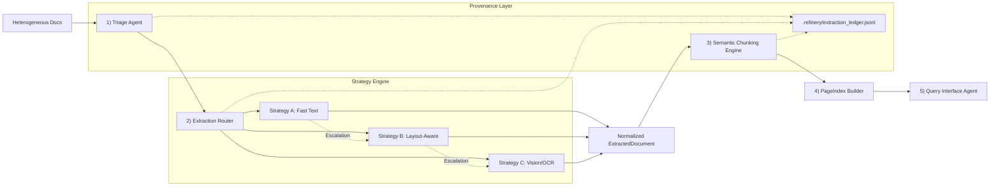
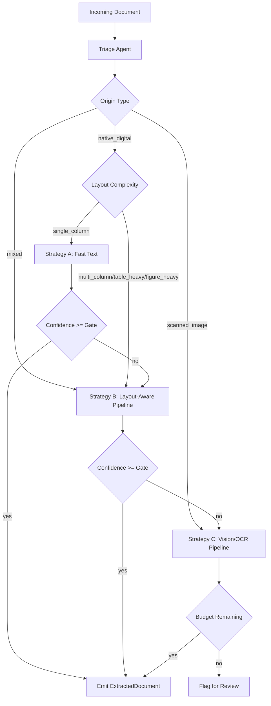

# Document Intelligence Refinery: Interim Report

## 1. Executive Summary
This report presents the foundational Document Science research (Phase 0) and the resulting architectural design for the Document Intelligence Refinery. The system is designed to ingest highly heterogeneous Ethiopian government and financial documents—ranging from native digital reports to noisy scanned legal audits—and extract them into structured, reliable semantic chunks for downstream RAG. 

Based on empirical analysis of the corpus, we have developed a 5-stage pipeline featuring a **Triage Agent** for initial classification and an **Extraction Router** that employs a **Confidence-Gated Escalation** pattern. This ensures cost-effective processing by defaulting to fast, local text extraction (Strategy A) and escalating to layout-aware parsing (Strategy B) or Vision LLMs (Strategy C) only when required by document complexity or when quality thresholds fail.

---

## 2. Phase 0: Domain Notes & Document Science

### 2.1 Scope and Objective
**Goal:** Establish an extraction strategy before implementation by measuring document signals and comparing parser behavior across representative document classes.

**Corpus Sample Analyzed (12 pages each):**
- **Class A:** `CBE ANNUAL REPORT 2023-24.pdf` (Native Financial)
- **Class B:** `Audit Report - 2023.pdf` (Scanned Legal/Gov)
- **Class C:** `fta_performance_survey_final_report_2022.pdf` (Mixed/Technical)
- **Class D:** `tax_expenditure_ethiopia_2021_22.pdf` (Table-Heavy Fiscal)

### 2.2 Measured PDF Signals (pdfplumber)

| Class | Avg chars/page | Avg char density | Avg image ratio | Avg whitespace ratio | Avg bbox x-span ratio | Avg tables/page |
|---|---:|---:|---:|---:|---:|---:|
| A Annual Financial | 494.00 | 0.000986 | 0.380970 | 0.937136 | 0.616071 | 0.00 |
| B Scanned Gov/Legal | 10.08 | 0.000020 | 0.918017 | 0.991347 | 0.050395 | 0.00 |
| C Technical Assessment | 2595.75 | 0.005179 | 0.000605 | 0.769019 | 0.728307 | 0.33 |
| D Table-heavy Structured | 1970.08 | 0.003932 | 0.003592 | 0.823388 | 0.673215 | 0.00 |

**Interpretation:**
- **Class B** is decisively scanned: near-zero character density and a very high image ratio. Requires OCR/Vision.
- **Class C and D** are native-digital, high-text candidates perfect for layout-aware extraction.
- **Class A** exhibits mixed behavior with moderate image ratios and sparse text in early pages (covers, graphics).

### 2.3 Parser Comparison: pdfplumber vs. docling_parse

Both backends were evaluated locally on the 12-page samples:

| Class | Tool | Avg chars/page | Avg char density | Avg whitespace ratio | Text coverage ratio |
|---|---|---:|---:|---:|---:|
| A | pdfplumber | 494.00 | 0.000986 | 0.937136 | 0.833 |
| A | docling_parse | 417.08 | 0.000832 | 0.944723 | 0.833 |
| B | pdfplumber | 10.08 | 0.000020 | 0.991347 | 0.083 |
| B | docling_parse | 8.83 | 0.000017 | 0.991386 | 0.083 |
| C | pdfplumber | 2595.75 | 0.005179 | 0.769019 | 1.000 |
| C | docling_parse | 2337.58 | 0.004664 | 0.801132 | 1.000 |
| D | pdfplumber | 1970.08 | 0.003932 | 0.823388 | 1.000 |
| D | docling_parse | 1687.75 | 0.003369 | 0.848028 | 1.000 |

**Observed Quality Differences:**
- Both tools provide strong raw text extraction on C and D.
- Both fail catastrophically on scanned Class B without a dedicated OCR/Vision pipeline.
- `docling_parse` preserves structured word objects and font hierarchies cleanly, making it vastly superior for downstream semantic normalization (Strategy B).

---

## 3. Architecture & System Flow

### 3.1 Pipeline Diagram (Full 5-Stage View)

### 3.2 Current Implementation Status (Interim Milestone)
As of this interim submission, the system is fully operational through the first two stages:
*   **[COMPLETED] Stage 1 (Triage Agent):** Origin detection, language identification, and Layout complexity profiling are actively routing documents.
*   **[COMPLETED] Stage 2 (Extraction Router):** The Strategy Engine (A, B, C) and the Confidence-Gated Escalation logic are fully implemented, outputting the `Normalized ExtractedDocument` constraint.
*   **[COMPLETED] Provenance Layer:** The unified extraction ledger tracks token spend, strategy traces, and confidence scoring.
*   **[PENDING] Stages 3, 4, and 5 (Chunking, Indexing, Query Interface):** These stages are modeled in the architecture but are scheduled for implementation in the next phase of the challenge.

### 3.3 Component Responsibilities
1. **Triage Agent:** Analyzes the first `N` pages of a document to determine its origin (scanned, digital, form-fillable), script (e.g., Amharic), and layout complexity. It creates the `DocumentProfile`.
2. **Structure Extraction (Strategy Engine):** Routes the document to Strategy A, B, or C based on the profile, calculating confidence scores post-extraction. If confidence falls below the escalation gate (`0.85`), it aborts and escalates to a higher-tier strategy.
3. **Semantic Chunking:** Consumes the `ExtractedDocument` (text blocks, tables, figures) to generate Large Document Units (LDUs) according to semantic rules.
4. **PageIndex Builder:** Builds a hierarchical table of contents and indexes chunks for retrieval.
5. **Query Interface:** Processes user queries, routing to SQL facts or vector search, utilizing the provenance chain.
6. **Provenance Layer (Ledger):** A cross-cutting concern that logs strategy traces, costs, token spends, and spatial bounding boxes for complete auditability.

---

## 4. Extraction Strategy Formulation

### 4.1 Decision Logic Tree

### 4.2 Empirically Derived Thresholds
All routing and confidence decisions are driven by externally configured thresholds (`extraction_rules.yaml`):

- **Routing Thresholds:**
  - `origin_scanned_char_density_max = 0.0008` (Class B measured at `0.00002`).
  - `origin_scanned_image_ratio_min = 0.50` (Class B pages are ~`0.918` image-dominant).
  - `origin_digital_char_density_min = 0.0020` (Classes C and D exceed `0.0039`).
  
- **Confidence Escalation Gate:**
  - `escalation_confidence_gate = 0.85`. Values below this indicate structural collapse or noise.

- **Strategy C Budget Guardrails:**
  - `vision_budget_cap_usd = 1.00`.
  - Token accumulation stops processing completely if remaining budget drops below `0.01` USD.

---

## 5. Failure Modes Observed (Corpus-Grounded)

1. **Structure Collapse (Multi-column Corruption)**
- **Observed in:** Class A (`CBE ANNUAL REPORT 2023-24.pdf`)
- **Technical Cause:** The two-column layout in financial narratives causes naive text extraction to flatten lines horizontally across columns.
- **Impact:** Sentences are arbitrarily chopped, rendering semantic meaning illegible for RAG-based retrieval. Solved by Strategy B (Docling).

2. **Scanned-Document Starvation (Zero-Signal Retrieval)**
- **Observed in:** Class B (`Audit Report - 2023.pdf`)
- **Technical Cause:** Documents identified with near-zero character density and a high image ratio (`0.918`).
- **Impact:** Without the Strategy C escalation, this class yields zero usable text, making legal audit retrieval impossible.

3. **Context Poverty (Table Deconstruction)**
- **Observed in:** Class D (`tax_expenditure_ethiopia_2021_22.pdf`)
- **Technical Cause:** Complex fiscal tables spanning multiple pages result in broken row/header associations when extracted via naive text methods.
- **Impact:** The LLM cannot reliably associate numerical values with their correct fiscal periods without the explicit structural extraction of Strategy B.

4. **Provenance Blindness (Audit Failure)**
- **Observed in:** Class C (`fta_performance_survey_final_report_2022.pdf`)
- **Technical Cause:** Custom dense technical reports lack stable spatial anchors (bounding boxes) if only plain text strings are extracted.
- **Impact:** Human auditors cannot verify extracted conclusions against the 500-page source without page/bbox citations (now captured effectively by our extraction models and ledger).

---

## 6. Cost Analysis & Unit Economics

Deploying the Refinery over a millions-of-pages repository requires strict unit economics. The tiered routing design ensures we achieve the highest necessary quality while aggressively minimizing runtime costs.

### Tier A: Fast Text (pdfplumber)
- **Derivation:** CPU-bound local execution without heavy model initialization. No external API cost.
- **Est. Cost per Doc (20 pgs):** **~$0.00**
- **Est. Processing Time:** **< 0.5s**
- **Variation:** Flat cost regardless of document size.
- **Value Proposition:** Zero-cost, instantaneous processing for single-column native digital reports.

### Tier B: Layout-Aware (docling-parse)
- **Derivation:** Local structural C++ parsing. Modeled internally as `base_cost` ($0.005) + `per_page_cost` ($0.0015).
- **Est. Cost per Doc (20 pgs):** **~$0.035**
- **Est. Processing Time:** **2s - 10s**
- **Variation:** Processing time scales linearly with page count and structural complexity (e.g., number of tables).
- **Value Proposition:** Highly accurate table and column reconstruction for Class A/D documents where Tier A suffers structure collapse, running entirely offline.

### Tier C: Vision-Augmented (VLM via OpenRouter)
- **Derivation:** OpenRouter API invocation. Averages ~1,000 input tokens per page + image authorization tokens (at approx $0.000002/token).
- **Est. Cost per Doc (8 pgs limit):** **~$0.08 - $0.25**
- **Est. Processing Time:** **15s - 45s** (Network IO + Inference latency)
- **Variation:** High variation based on VLM image resolution requirements and chunk density. Strictly restricted by the `vision_budget_cap_usd` threshold to prevent runaway costs.
- **Value Proposition:** Unlocks "invisible" scanned PDFs (Class B) and handwritten documents, rescuing data that would otherwise be entirely lost.

---

## 7. Operational Repro Commands
- **Run Full Pipeline & Generate Artifacts/Ledger:** `python3 src/run_corpus.py --clean`
- **Execute Triage Unit Tests:** `pytest tests/test_triage.py`
- **Verify Vision Integration:** Inspect `.refinery/extraction_ledger.jsonl` to verify dynamic strategy routing and token-spend tracking.
